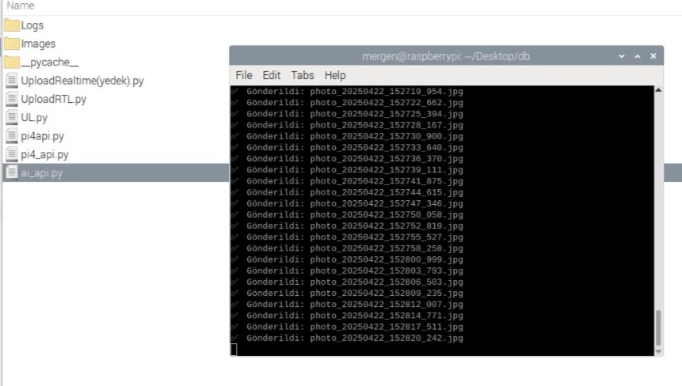
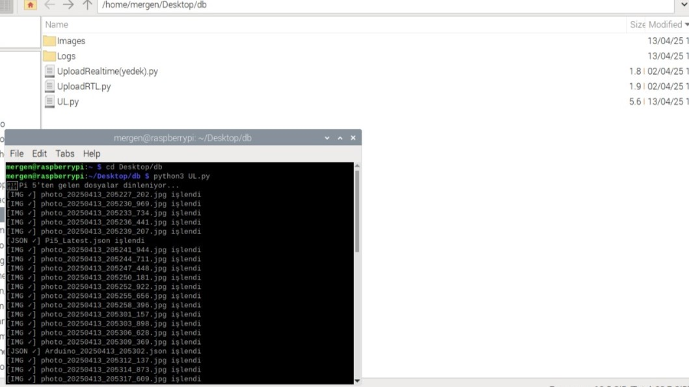
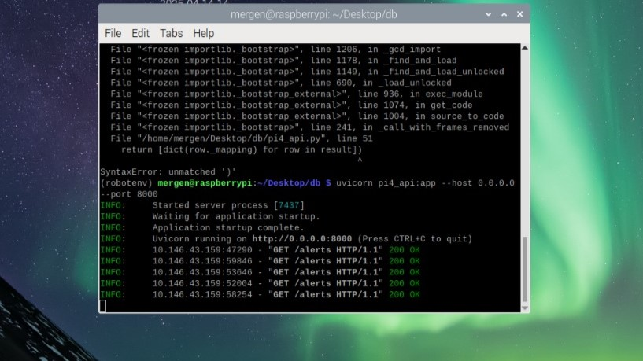
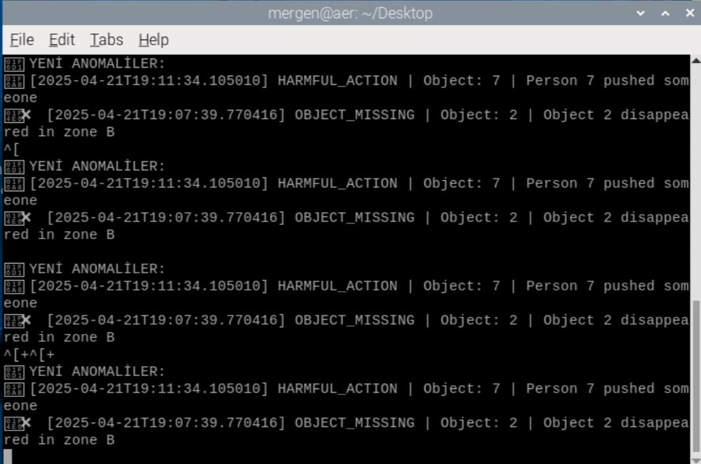

# 🔧 Backend Modules for Embedded Security Robot (University Project)

This repository contains backend modules I developed as part of a group project for a university Software Engineering course. The overall system was designed to operate as an embedded, AI-assisted security robot using Raspberry Pi and Arduino platforms.

⚠️ Important Note:
- This repo includes only the backend modules that I personally authored or co-developed.
- AI inference logic and model code are excluded, as those were implemented by another teammate.
- This codebase is shared solely for academic and personal demonstration purposes. If you are affiliated with the original client and believe this repository discloses internal or proprietary components, please contact me for takedown or review.

---

## 🎓 Project Context

- 📚 Software Engineering Term Project (Spring 2024–2025)
- 🤝 Collaborative work with a small team (3 members)
- 🎯 Objective: Build a Raspberry Pi + Arduino-based robotic system with real-time monitoring, anomaly detection, and web access

---

## 📁 Included Modules (This Repository)

- `send_database.py` — Runs on RPi5, collects Arduino/system data, logs to .json, sends via SCP to Pi4  
- `UL.py` — Runs on RPi4, parses JSON/image logs and inserts them into PostgreSQL  
- `webapi.py` — FastAPI server serving image and log archives to frontend clients  
- `full_api.py` — API layer bridging log/image data from Pi4 to AI analysis server

---

## 🔧 Technologies Used

- Python 3  
- FastAPI · PostgreSQL · Serial Communication  
- Raspberry Pi 4 & 5 · Arduino Uno  
- JSON + SCP for file transfer

---

## 🖼️ Screenshots

Below are some screenshots captured during earlier development stages of the backend system:

| Pi5 Log Sender (send_database.py) | Pi4 Log Handler (UL.py)        |
|-----------------------------------|--------------------------------|
|  |  |

| Web API Interface (Pi4)           | AI Inference Output (Old API)  |
|-----------------------------------|--------------------------------|
|  |  |

> 📸 These screenshots reflect earlier versions of the backend modules. While the architecture has since evolved (e.g. full_api.py integration), they demonstrate the core data flow and backend operation across devices.

---

## 👤 Author

**Burak Çam**  
Backend Developer  
[github.com/Burak-Cam](https://github.com/Burak-Cam)

---

## 📜 License

License shared under a custom non-commercial license. See LICENSE file for details.
